# AlkGraph Agent Memory System Plan

## Overview

The agent memory system will help different roles maintain context between tasks by providing a structured way to record and access important information. Each role will have its own memory file that captures role-specific information and references to relevant project documentation.

```mermaid
flowchart TD
    A[docs/memory/] --> B[README.md]
    A --> C[architect.md]
    A --> D[code.md]
    A --> E[debug.md]
    A --> F[orchestrator.md]
    
    B --> G[Purpose and Guidelines]
    
    C --> H[Architect Memory]
    H --> H1[Role Description]
    H --> H2[Key Information]
    H --> H3[Documentation References]
    H --> H4[Recent Decisions]
    H --> H5[Current State]
    
    D --> I[Code Memory]
    I --> I1[Role Description]
    I --> I2[Key Information]
    I --> I3[Documentation References]
    I --> I4[Recent Decisions]
    I --> I5[Current State]
    
    E --> J[Debug Memory]
    J --> J1[Role Description]
    J --> J2[Key Information]
    J --> J3[Documentation References]
    J --> J4[Recent Decisions]
    J --> J5[Current State]
    
    F --> K[Orchestrator Memory]
    K --> K1[Role Description]
    K --> K2[Key Information]
    K --> K3[Documentation References]
    K --> K4[Recent Decisions]
    K --> K5[Current State]
```



## Implementation Steps

### 1. Create Directory Structure

Create the `docs/memory` directory and the following files:
- `docs/memory/README.md`
- `docs/memory/architect.md`
- `docs/memory/code.md`
- `docs/memory/debug.md`
- `docs/memory/orchestrator.md`

### 2. Develop README.md Content

The README.md file will explain:
- The purpose of the memory system
- How and when memory files should be updated
- Guidelines for what information should be included
- How roles should use these files at the beginning of tasks

### 3. Define Common Structure for Memory Files

Each memory file will follow a common structure:
1. **Role Description**: A brief description of the role's responsibilities
2. **Key Information**: Important information the role needs to remember between tasks
3. **Documentation References**: Links to relevant sections of project documentation
4. **Recent Decisions**: A section for tracking recent decisions made by the role
5. **Current State**: A section describing the current state of components relevant to that role

### 4. Populate Role-Specific Content

#### Architect Memory (architect.md)
- **Role Description**: Focus on high-level design and architecture planning
- **Key Information**: Architectural patterns, design principles, system boundaries
- **Documentation References**: Links to architecture documents, especially storage-architecture-plan.md
- **Recent Decisions**: Track architectural decisions and their rationales
- **Current State**: Current architectural state, planned improvements, technical debt

#### Code Memory (code.md)
- **Role Description**: Focus on implementation details and code quality
- **Key Information**: Code organization, dependencies, implementation patterns
- **Documentation References**: Links to development standards and directory structure
- **Recent Decisions**: Track implementation decisions and code changes
- **Current State**: Current implementation state, code coverage, pending refactorings

#### Debug Memory (debug.md)
- **Role Description**: Focus on identifying and resolving issues
- **Key Information**: Common error patterns, debugging techniques, test strategies
- **Documentation References**: Links to testing standards and error handling sections
- **Recent Decisions**: Track debugging approaches and solutions
- **Current State**: Current known issues, resolved bugs, test coverage

#### Orchestrator Memory (orchestrator.md)
- **Role Description**: Focus on coordinating tasks and workflow
- **Key Information**: Task dependencies, workflow patterns, coordination points
- **Documentation References**: Links to project overview and implementation approach
- **Recent Decisions**: Track task sequencing and delegation decisions
- **Current State**: Current project progress, upcoming milestones, blocked tasks

### 5. Implement Automatic Update Mechanism

Design the memory files to be automatically updated after each task:
- Include timestamps for updates
- Structure content to make it easy to append new information
- Provide clear guidelines for what information should be added after each task

## Detailed File Content Plans

### README.md Content Plan

```markdown
# AlkGraph Agent Memory System

## Purpose

The AlkGraph Agent Memory System helps different roles maintain context between tasks by providing a structured way to record and access important information. This system ensures continuity and knowledge retention as different agents work on the project.

## Memory Files

The system includes the following memory files:

- [Architect Memory](architect.md) - For the Architect role
- [Code Memory](code.md) - For the Code role
- [Debug Memory](debug.md) - For the Debug role
- [Orchestrator Memory](orchestrator.md) - For the Orchestrator role

## Automatic Updates

Memory files are automatically updated after each task. Agents should:

1. Add information about decisions made during the task
2. Document changes implemented
3. Update the current state section
4. Add any new references to project documentation

## Information Guidelines

Memory files should include:

1. **Role-specific information** relevant to the role's responsibilities
2. **References to documentation** with links to specific sections
3. **Recent decisions** with rationales and implications
4. **Current state** information about relevant components
5. **Timestamps** for all updates

## Usage Guidelines

At the beginning of each task, agents should:

1. Review the memory file for their role
2. Check recent decisions and current state
3. Refer to linked documentation as needed
4. Consider how the current task relates to previous work
5. Update the memory file after completing the task
```

### Role Memory File Template

```markdown
# [Role] Memory

## Role Description

[Brief description of the role's responsibilities]

## Key Information

[Important information the role needs to remember between tasks]

## Documentation References

- [Development Standards](../development-standards.md)
  - [Relevant Section](../development-standards.md#relevant-section)
- [Directory Structure Plan](../directory-structure-plan.md)
  - [Relevant Section](../directory-structure-plan.md#relevant-section)
- [Storage Architecture Plan](../storage-architecture-plan.md)
  - [Relevant Section](../storage-architecture-plan.md#relevant-section)

## Recent Decisions

### [YYYY-MM-DD] Decision Title

[Description of the decision, rationale, and implications]

## Current State

### Component: [Component Name]

[Description of the current state of this component]

### Component: [Another Component]

[Description of the current state of this component]
```

## Implementation Considerations

1. **Markdown Format**: All files will be in Markdown format for easy reading and editing.
2. **Linking Strategy**: Use relative links to reference other documentation files and specific sections.
3. **Update Process**: Structure the files to make it easy to append new information at the end of sections.
4. **Versioning**: Include timestamps for all updates to track when information was added.
5. **Consistency**: Maintain a consistent structure across all memory files for ease of use.

## Success Criteria

The memory system will be considered successful if:
1. It provides clear context for each role at the beginning of a task
2. It maintains a record of important decisions and their rationales
3. It tracks the current state of relevant components
4. It integrates well with existing project documentation
5. It can be automatically updated after each task

## Role-Specific Memory Content

### Architect Memory

The Architect memory will focus on design decisions and architectural patterns:
- System architecture and component relationships
- Design patterns used in the project
- Architectural constraints and trade-offs
- Future architectural plans and technical debt
- References to architectural documentation

### Code Memory

The Code memory will track implementation details and dependencies:
- Code organization and structure
- Implementation patterns and conventions
- Dependencies and their versions
- Code quality metrics and technical debt
- References to development standards and code examples

### Debug Memory

The Debug memory will maintain error patterns and solutions:
- Common error patterns and their solutions
- Debugging techniques specific to the project
- Test coverage and testing strategies
- Known issues and workarounds
- References to error handling documentation

### Orchestrator Memory

The Orchestrator memory will remember task sequences and coordination points:
- Task dependencies and workflow patterns
- Coordination points between different components
- Project progress and milestones
- Resource allocation and constraints
- References to project planning documentation