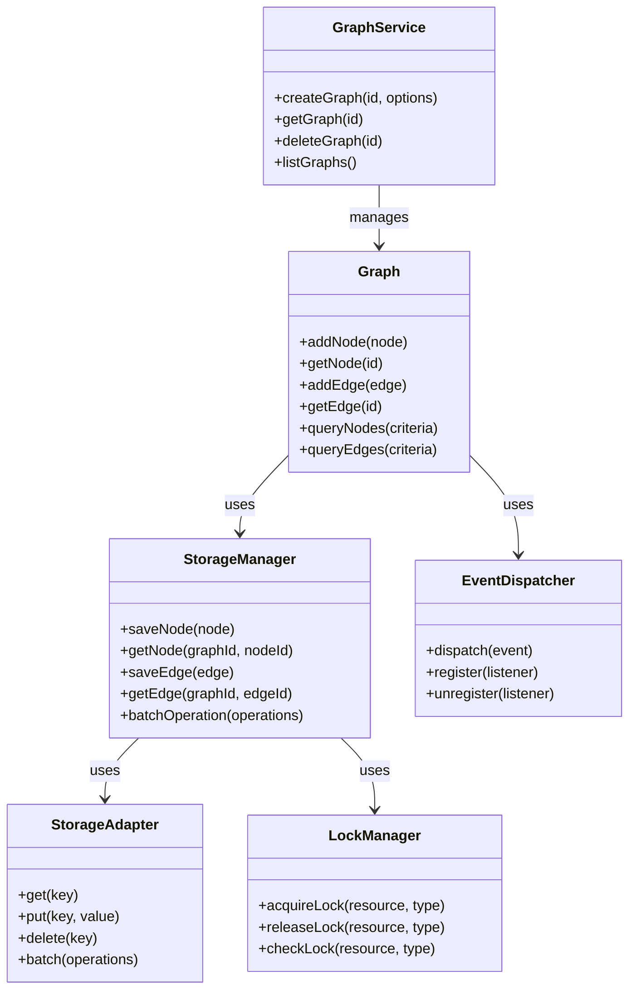

# AlkGraph Directory Structure Plan

## Table of Contents

1. [Overview](#overview)
2. [Source Directory Structure](#source-directory-structure)
   - [/src/types](#srctypes)
   - [/src/errors](#srcerrors)
   - [/src/utils](#srcutils)
   - [/src/graph](#srcgraph)
   - [/src/storage](#srcstorage)
   - [/src/events](#srcevents)
   - [/src/concurrency](#srcconcurrency)
   - [/src/versioning](#srcversioning)
   - [/src/memory](#srcmemory)
3. [Test Directory Structure](#test-directory-structure)
4. [File Size and Organization Guidelines](#file-size-and-organization-guidelines)
5. [Component Relationships](#component-relationships)
6. [Directory Structure Benefits](#directory-structure-benefits)
7. [Implementation Considerations](#implementation-considerations)
8. [Conclusion](#conclusion)

## Overview

This document outlines the directory structure for the AlkGraph project, based on the storage architecture plan and development standards. The structure is designed to organize code logically, enforce file size constraints, facilitate testing, and support all architectural aspects.

```mermaid
flowchart TD
    src[src/] --> types[types/]
    src --> errors[errors/]
    src --> utils[utils/]
    src --> graph[graph/]
    src --> storage[storage/]
    src --> events[events/]
    src --> concurrency[concurrency/]
    src --> versioning[versioning/]
    src --> memory[memory/]
    
    tests[tests/] --> testTypes[types/]
    tests --> testErrors[errors/]
    tests --> testUtils[utils/]
    tests --> testGraph[graph/]
    tests --> testStorage[storage/]
    tests --> testEvents[events/]
    tests --> testConcurrency[concurrency/]
    tests --> testVersioning[versioning/]
    tests --> testMemory[memory/]
    
    style src fill:#f9f,stroke:#333,stroke-width:2px
    style tests fill:#bbf,stroke:#333,stroke-width:2px
```

## Source Directory Structure

### `/src`

The main source directory containing all code for the AlkGraph library.

#### `/src/types`

**Purpose**: Centralized location for all shared TypeScript interfaces, types, and enums.

**Files**:
- `index.ts` - Exports all types
- `graph.types.ts` - Graph-related types
- `node.types.ts` - Node-related types
- `edge.types.ts` - Edge-related types
- `storage.types.ts` - Storage-related types
- `event.types.ts` - Event-related types
- `query.types.ts` - Query-related types
- `metadata.types.ts` - Metadata-related types
- `concurrency.types.ts` - Concurrency-related types
- `versioning.types.ts` - Versioning-related types

**Naming Convention**: `[feature].types.ts`

#### `/src/errors`

**Purpose**: Centralized location for all error classes.

**Files**:
- `index.ts` - Exports all errors
- `graph.errors.ts` - Graph-related errors
- `storage.errors.ts` - Storage-related errors
- `validation.errors.ts` - Validation-related errors
- `concurrency.errors.ts` - Concurrency-related errors
- `resource.errors.ts` - Resource-related errors

**Naming Convention**: `[category].errors.ts`

#### `/src/utils`

**Purpose**: Shared utility functions and helpers.

**Files**:
- `index.ts` - Exports all utilities
- `serialization.utils.ts` - Serialization utilities
- `validation.utils.ts` - Validation utilities
- `key.utils.ts` - Key generation utilities
- `logging.utils.ts` - Logging utilities
- `pagination.utils.ts` - Pagination utilities
- `batch.utils.ts` - Batch operation utilities

**Naming Convention**: `[functionality].utils.ts`

#### `/src/graph`

**Purpose**: Graph service and related components.

**Files**:
- `index.ts` - Exports all graph components
- `graph-service.interface.ts` - Graph service interface
- `graph-service.ts` - Graph service implementation
- `graph.interface.ts` - Graph interface
- `graph.ts` - Graph implementation
- `node.interface.ts` - Node interface
- `node.ts` - Node implementation
- `edge.interface.ts` - Edge interface
- `edge.ts` - Edge implementation
- `query.interface.ts` - Query interface
- `query.ts` - Query implementation

**Naming Convention**: `[component](.interface)?.ts`

#### `/src/storage`

**Purpose**: Storage-related components.

**Files**:
- `index.ts` - Exports all storage components
- `storage-manager.interface.ts` - Storage manager interface
- `storage-manager.ts` - Storage manager implementation
- `storage-adapter.interface.ts` - Storage adapter interface
- `leveldb-adapter.ts` - LevelDB adapter implementation
- `key-structure.ts` - Key structure definitions
- `serialization.ts` - Serialization logic
- `attribute-processor.interface.ts` - Attribute processor interface
- `attribute-processor.ts` - Attribute processor implementation
- `index-manager.interface.ts` - Index manager interface
- `index-manager.ts` - Index manager implementation

**Naming Convention**: `[component](.interface)?.ts`

#### `/src/storage/metadata`

**Purpose**: Metadata management components.

**Files**:
- `index.ts` - Exports all metadata components
- `metadata-manager.interface.ts` - Metadata manager interface
- `metadata-manager.ts` - Metadata manager implementation
- `graph-metadata.ts` - Graph metadata implementation
- `statistics.ts` - Statistics calculation utilities

**Naming Convention**: `[component](.interface)?.ts`

#### `/src/events`

**Purpose**: Event system components.

**Files**:
- `index.ts` - Exports all event components
- `event-dispatcher.interface.ts` - Event dispatcher interface
- `event-dispatcher.ts` - Event dispatcher implementation
- `event-listener.interface.ts` - Event listener interface
- `event-queue.ts` - Event queue implementation
- `event-processor.ts` - Event processor implementation
- `event-filter.ts` - Event filtering utilities
- `event-types.ts` - Event type definitions
- `event-persistence.interface.ts` - Event persistence interface
- `event-persistence.ts` - Event persistence implementation

**Naming Convention**: `[component](.interface)?.ts`

#### `/src/concurrency`

**Purpose**: Concurrency control components.

**Files**:
- `index.ts` - Exports all concurrency components
- `lock-manager.interface.ts` - Lock manager interface
- `lock-manager.ts` - Lock manager implementation
- `transaction.interface.ts` - Transaction interface
- `transaction.ts` - Transaction implementation
- `isolation-level.ts` - Isolation level definitions
- `conflict-detection.ts` - Conflict detection utilities
- `conflict-resolution.ts` - Conflict resolution utilities
- `optimistic-concurrency.ts` - Optimistic concurrency implementation
- `pessimistic-concurrency.ts` - Pessimistic concurrency implementation

**Naming Convention**: `[component](.interface)?.ts`

#### `/src/versioning`

**Purpose**: Versioning and schema evolution components.

**Files**:
- `index.ts` - Exports all versioning components
- `schema-manager.interface.ts` - Schema manager interface
- `schema-manager.ts` - Schema manager implementation
- `schema-version.ts` - Schema version utilities
- `migration.interface.ts` - Migration interface
- `migration.ts` - Migration implementation
- `compatibility.ts` - Compatibility utilities
- `schema-validation.ts` - Schema validation utilities

**Naming Convention**: `[component](.interface)?.ts`

#### `/src/memory`

**Purpose**: Memory management components.

**Files**:
- `index.ts` - Exports all memory management components
- `cache-manager.interface.ts` - Cache manager interface
- `cache-manager.ts` - Cache manager implementation
- `cache-policy.ts` - Cache policy implementations
- `prefetching.ts` - Prefetching utilities
- `pagination.ts` - Pagination utilities
- `lazy-loading.ts` - Lazy loading utilities
- `resource-manager.ts` - Resource management utilities
- `memory-monitor.ts` - Memory monitoring utilities

**Naming Convention**: `[component](.interface)?.ts`

## Test Directory Structure

The test directory structure will mirror the source directory structure exactly, with each source file having a corresponding test file.

### `/tests`

The main test directory containing all tests for the AlkGraph library.

#### `/tests/types`

**Purpose**: Tests for type definitions.

**Files**:
- `graph.types.test.ts`
- `node.types.test.ts`
- `edge.types.test.ts`
- etc.

**Naming Convention**: `[source-file-name].test.ts`

#### `/tests/errors`

**Purpose**: Tests for error classes.

**Files**:
- `graph.errors.test.ts`
- `storage.errors.test.ts`
- `validation.errors.test.ts`
- etc.

**Naming Convention**: `[source-file-name].test.ts`

#### `/tests/utils`

**Purpose**: Tests for utility functions.

**Files**:
- `serialization.utils.test.ts`
- `validation.utils.test.ts`
- `key.utils.test.ts`
- etc.

**Naming Convention**: `[source-file-name].test.ts`

And so on for all other directories, mirroring the source structure exactly.

## File Size and Organization Guidelines

### File Size Constraints

- **Ideal file size**: 100-300 lines of code
- **Maximum file size**: 500 lines of code
- **Warning threshold**: 400+ lines of code

To enforce these constraints:

1. **Single Responsibility Principle**: Each file should have a single, well-defined responsibility.
2. **Interface Separation**: Interfaces and implementations are in separate files.
3. **Utility Extraction**: Common utilities are extracted to dedicated utility files.
4. **Component Decomposition**: Large components are broken down into smaller, focused components.

### Function Size Constraints

- **Ideal function size**: 5-15 lines of code
- **Maximum function size**: 30 lines of code
- **Warning threshold**: 25+ lines of code

To enforce these constraints:

1. **Single Purpose Functions**: Each function should do one thing well.
2. **Helper Functions**: Extract complex logic into helper functions.
3. **Composition**: Use function composition to build complex behavior from simple functions.

## Component Relationships



## Directory Structure Benefits

### 1. Logical Organization

The directory structure organizes code by feature, making it easy to locate related components. Each feature directory contains all the files related to that feature, including interfaces, implementations, and feature-specific utilities.

### 2. Separation of Concerns

The structure enforces a clear separation of concerns:
- **Types**: Define the shape of data
- **Errors**: Handle error cases
- **Utils**: Provide shared functionality
- **Feature Directories**: Implement specific features

### 3. Testability

The structure facilitates testing by:
- Keeping components small and focused
- Separating interfaces from implementations (enabling mocking)
- Mirroring the source structure in tests for easy navigation

### 4. Scalability

The structure is designed to scale as the project grows:
- New features can be added as new directories
- Existing features can be extended without affecting others
- Common functionality is centralized to avoid duplication

### 5. Maintainability

The structure promotes maintainability by:
- Enforcing file size constraints
- Keeping related code together
- Providing clear naming conventions
- Separating interfaces from implementations

## Implementation Considerations

### 1. Barrel Files

Each directory should have an `index.ts` file that exports all public components, allowing for clean imports:

```typescript
// Import from a feature
import { Graph } from './graph';

// Import from a specific file
import { Graph } from './graph/graph';
```

### 2. Circular Dependencies

To avoid circular dependencies:
- Keep interfaces in separate files
- Use dependency injection
- Consider using a mediator pattern for complex interactions

### 3. File Naming

Consistent file naming helps with navigation:
- Interfaces: `[name].interface.ts`
- Implementations: `[name].ts`
- Utilities: `[name].utils.ts`
- Types: `[name].types.ts`
- Errors: `[name].errors.ts`
- Tests: `[name].test.ts`

### 4. Documentation

Each file should include:
- A header comment describing its purpose
- JSDoc comments for all public APIs
- Examples for complex functionality

## Conclusion

This directory structure plan provides a comprehensive organization for the AlkGraph project that:
- Aligns with the storage architecture plan
- Enforces the file size constraints
- Facilitates testing
- Supports all architectural aspects (event system, error handling, etc.)
- Follows a feature-based organization
- Separates interfaces from implementations
- Centralizes common utilities, types, and errors

The structure is designed to be flexible and scalable, allowing for future expansion while maintaining a clean and organized codebase.