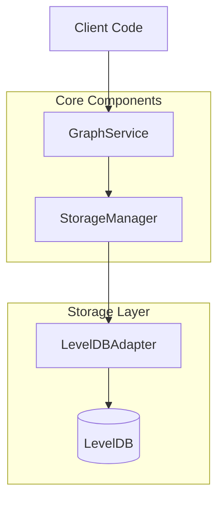
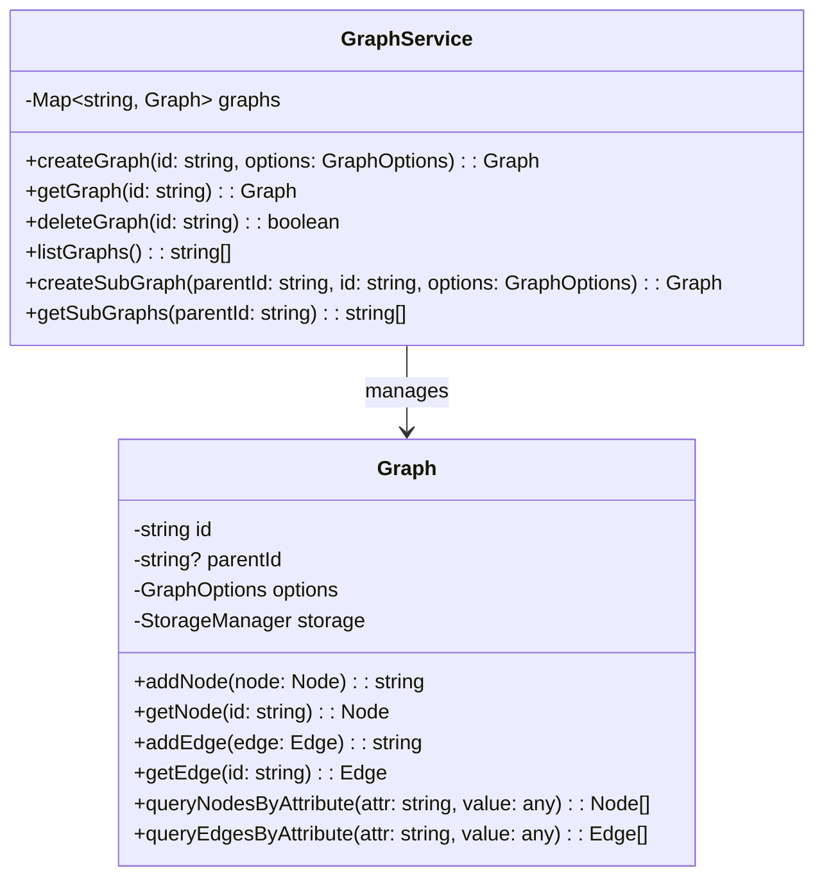
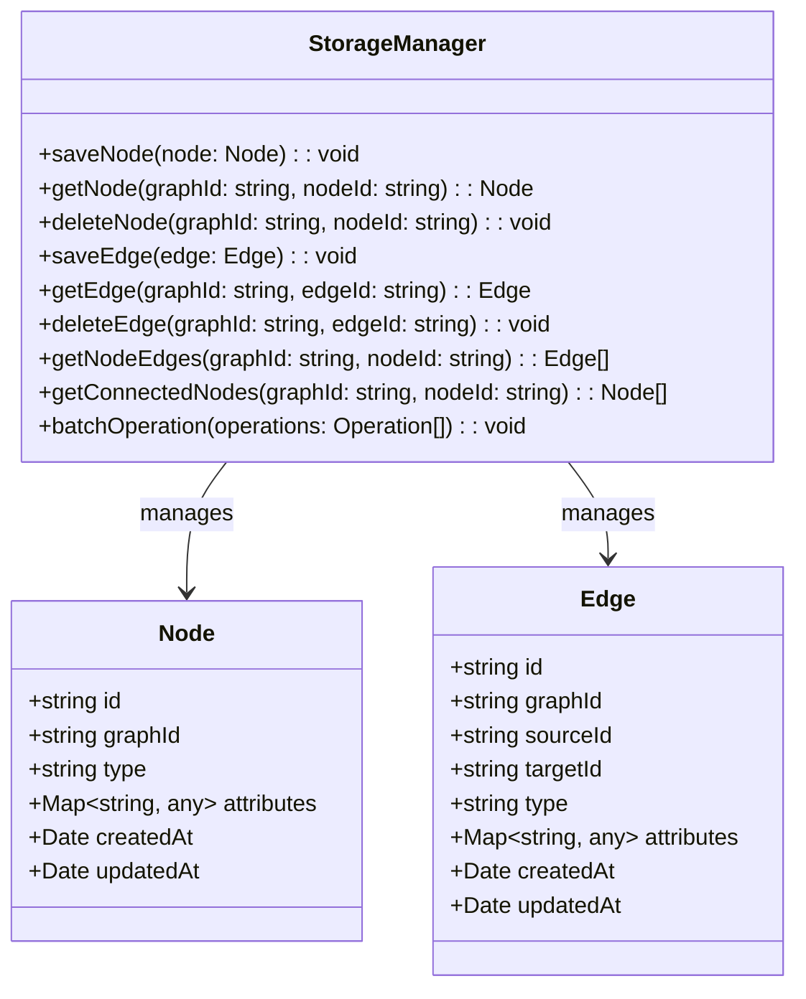
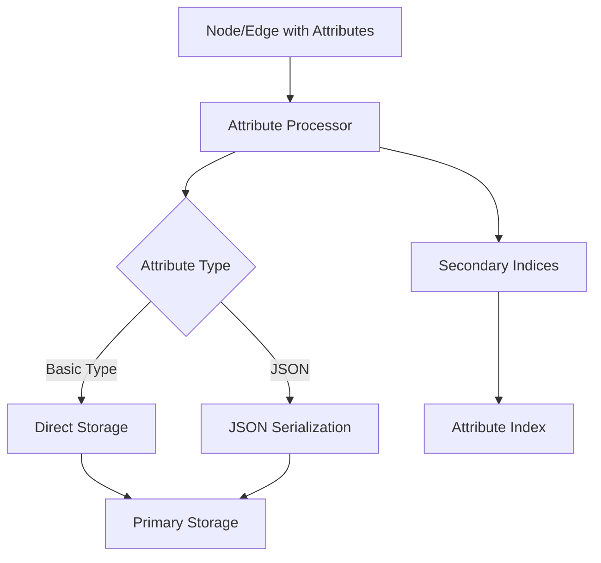
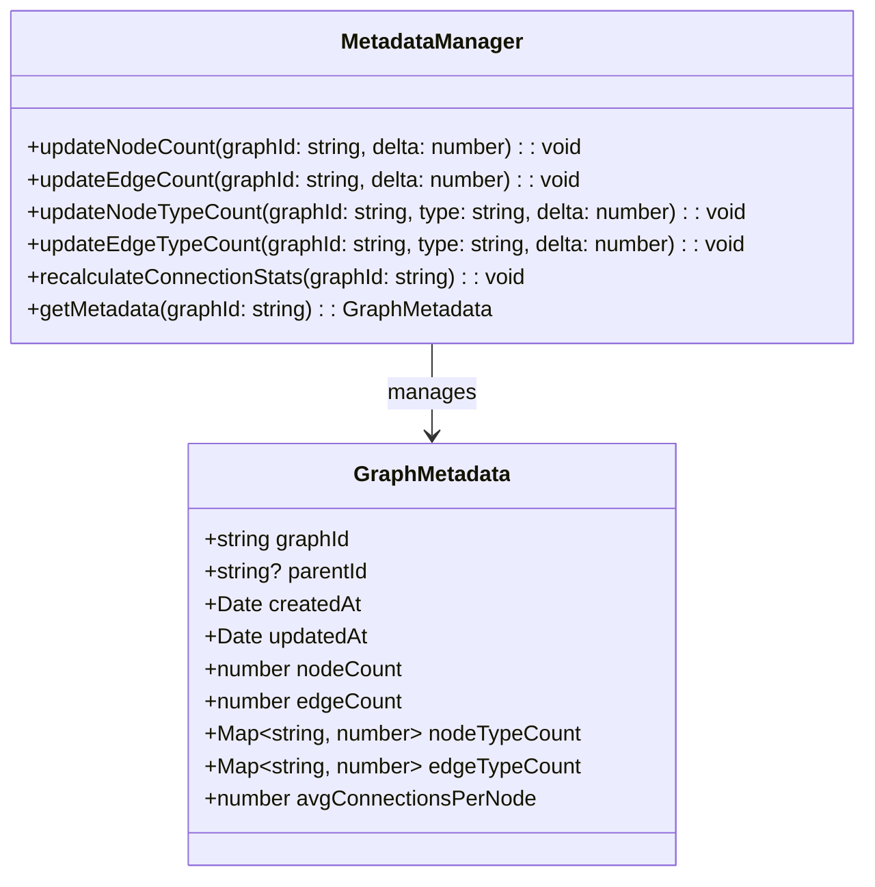
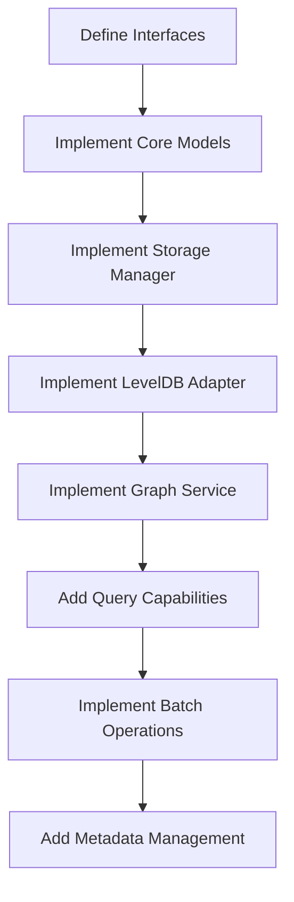
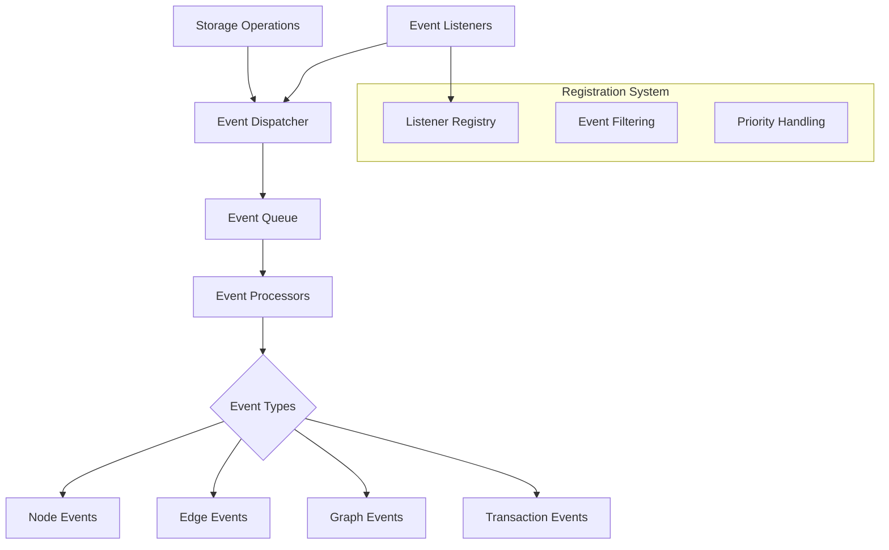

# AlkGraph Storage Architecture Plan

## Table of Contents

1. [Overall Architecture](#1-overall-architecture)
2. [Graph Service Concept](#2-graph-service-concept)
3. [Node and Edge Storage](#3-node-and-edge-storage)
4. [Attribute Storage System](#4-attribute-storage-system)
5. [Book-keeping and Metadata](#5-book-keeping-and-metadata)
6. [LevelDB Key Structure](#6-leveldb-key-structure)
7. [Implementation Approach](#7-implementation-approach)
8. [Performance Considerations](#8-performance-considerations)
9. [Example Usage](#9-example-usage)
10. [Event System Integration](#10-event-system-integration)
11. [Error Handling and Recovery Strategies](#11-error-handling-and-recovery-strategies)
12. [Concurrency Control for Multiple Writers](#12-concurrency-control-for-multiple-writers)
13. [Versioning and Schema Evolution](#13-versioning-and-schema-evolution)
14. [Memory Management Strategies](#14-memory-management-strategies)

## 1. Overall Architecture



The architecture follows a layered approach:

- **Client Code**: Application code that uses the AlkGraph library
- **Graph Service**: High-level API for managing multiple graphs and sub-graphs
- **Storage Manager**: Handles the storage logic, including key generation and data serialization
- **LevelDB Adapter**: Implements the storage interface using LevelDB
- **LevelDB**: The actual database storage

## 2. Graph Service Concept



### Key Design Decisions:

1. **Multiple Graph Support**: The `GraphService` acts as a registry and factory for graphs, allowing multiple graphs to be created and managed.

2. **Sub-Graph Implementation**: Sub-graphs are implemented as separate graph entities with a reference to their parent graph. This allows for:
   - Independent operations on sub-graphs
   - Hierarchical relationships between graphs
   - Ability to perform operations across the hierarchy when needed

3. **Graph Identification**: Each graph has a unique ID, and sub-graphs maintain a reference to their parent graph's ID.

4. **Storage Isolation**: Each graph has its own logical storage space within LevelDB, preventing conflicts between graphs.

## 3. Node and Edge Storage



### Key Design Decisions:

1. **Graph Membership**: Both nodes and edges store their parent graph ID, making it easy to query all elements of a specific graph.

2. **Relationship Storage**: Edges store references to their source and target nodes, enabling efficient traversal.

3. **Attribute Storage**: Attributes are stored as a map of key-value pairs, supporting both basic types and JSON.

4. **Timestamps**: Creation and update timestamps are automatically maintained for all entities.

5. **Batch Operations**: The storage manager supports batched operations for improved performance when making multiple changes.

## 4. Attribute Storage System



### Key Design Decisions:

1. **Flexible Attribute Types**: Support for basic types (strings, numbers, booleans) and complex JSON objects.

2. **Efficient Querying**: Secondary indices for attributes to enable efficient querying by attribute values.

3. **First-Level JSON Property Matching**: Support for querying on first-level properties of JSON attributes.

4. **Comparison Operators**: Support for basic comparison operators (=, >, <, >=, <=) for numeric attributes.

5. **Attribute Index Structure**:
   - For basic types: `graph:{graphId}:attr:{attrName}:{attrValue}:{nodeId/edgeId}`
   - For JSON first-level properties: `graph:{graphId}:attr:{attrName}.{propName}:{propValue}:{nodeId/edgeId}`

## 5. Book-keeping and Metadata



### Key Design Decisions:

1. **Automatic Updates**: Metadata is automatically updated as operations occur (nodes/edges added or removed).

2. **Operational Metrics**: Track creation/modification timestamps, node/edge counts per graph, and counts by type.

3. **Relationship Statistics**: Track average connections per node and other relationship statistics.

4. **Efficient Storage**: Metadata is stored in a compact format to minimize storage overhead.

5. **Periodic Recalculation**: Some statistics (like average connections) can be periodically recalculated rather than updated on every operation for better performance.

## 6. LevelDB Key Structure

The key structure is critical for efficient operations in LevelDB. Here's the proposed key structure:

### Primary Keys:

1. **Graph Metadata**: `meta:graph:{graphId}`
2. **Node Data**: `graph:{graphId}:node:{nodeId}`
3. **Edge Data**: `graph:{graphId}:edge:{edgeId}`
4. **Node-Edge Relationship**: `graph:{graphId}:node:{nodeId}:edges`
5. **Graph Hierarchy**: `graph:{graphId}:subgraphs`

### Secondary Indices:

1. **Node Type Index**: `graph:{graphId}:nodetype:{type}:{nodeId}`
2. **Edge Type Index**: `graph:{graphId}:edgetype:{type}:{edgeId}`
3. **Node Attribute Index**: `graph:{graphId}:nodeattr:{attrName}:{attrValue}:{nodeId}`
4. **Edge Attribute Index**: `graph:{graphId}:edgeattr:{attrName}:{attrValue}:{edgeId}`
5. **Source-Target Index**: `graph:{graphId}:source:{sourceId}:target:{targetId}:{edgeId}`

### Key Design Decisions:

1. **Prefix-Based Organization**: Keys are organized with prefixes to leverage LevelDB's lexicographical sorting for efficient range queries.

2. **Graph Isolation**: All keys include the graph ID to isolate data between different graphs.

3. **Relationship Indexing**: Indices for node-edge relationships and source-target relationships enable efficient traversal.

4. **Attribute Indexing**: Secondary indices for attributes enable efficient querying by attribute values.

5. **Batched Operations**: The key structure supports efficient batched operations by grouping related keys together.

## 7. Implementation Approach



### Implementation Phases:

1. **Define Interfaces**: Create clear interfaces for all components to ensure proper separation of concerns.

2. **Implement Core Models**: Implement the basic Node and Edge models with attribute support.

3. **Implement Storage Manager**: Create the storage manager with key generation and data serialization.

4. **Implement LevelDB Adapter**: Implement the LevelDB adapter using the 'level' package.

5. **Implement Graph Service**: Create the graph service for managing multiple graphs and sub-graphs.

6. **Add Query Capabilities**: Implement attribute-based querying with support for comparison operators.

7. **Implement Batch Operations**: Add support for efficient batched operations.

8. **Add Metadata Management**: Implement automatic metadata updates and statistics tracking.

## 8. Performance Considerations

1. **Batched Operations**: Use LevelDB's batch operations for multiple writes to improve performance.

2. **Efficient Key Design**: The key structure is designed to minimize the number of operations needed for common tasks.

3. **Selective Indexing**: Only create indices for attributes that need to be queried frequently.

4. **Lazy Loading**: Implement lazy loading for large collections of nodes or edges.

5. **Caching**: Consider adding an in-memory cache for frequently accessed data.

6. **Bulk Operations**: Provide specialized APIs for bulk operations like importing/exporting graphs.

## 9. Example Usage

```typescript
// Create a graph service
const graphService = new GraphService();

// Create a main graph
const mainGraph = graphService.createGraph('main', { directed: true });

// Add nodes to the graph
const nodeId1 = mainGraph.addNode({
  type: 'person',
  attributes: {
    name: 'Alice',
    age: 30,
    metadata: { interests: ['programming', 'music'] }
  }
});

const nodeId2 = mainGraph.addNode({
  type: 'person',
  attributes: {
    name: 'Bob',
    age: 25,
    metadata: { interests: ['sports', 'movies'] }
  }
});

// Add an edge between nodes
mainGraph.addEdge({
  sourceId: nodeId1,
  targetId: nodeId2,
  type: 'knows',
  attributes: {
    since: '2020-01-01',
    strength: 0.8
  }
});

// Create a sub-graph
const subGraph = graphService.createSubGraph('main', 'friends', { directed: true });

// Query nodes by attribute
const youngPeople = mainGraph.queryNodesByAttribute('age', { $lt: 30 });
```

## 10. Event System Integration



### Event Triggering Mechanism

The event system will be tightly integrated with the storage layer to ensure that all persistent operations generate appropriate events:

1. **Storage Operation Hooks**: Each storage operation (create, read, update, delete) will include pre and post hooks that trigger events.

2. **Synchronous vs. Asynchronous Events**: 
   - Critical events (e.g., node creation) will be processed synchronously to ensure data consistency
   - Non-critical events (e.g., statistics updates) can be processed asynchronously for better performance

3. **Batched Event Processing**:
   - During batch operations, events will be collected and dispatched as a single batch
   - This reduces overhead and improves performance for bulk operations
   - Listeners can opt to receive individual events or the entire batch

4. **Transaction-Bound Events**:
   - Events can be bound to transactions
   - Events are only dispatched when the transaction is committed
   - If a transaction is rolled back, the associated events are discarded

### Event Types

The system will support the following event types:

1. **Node Events**:
   - `node.created`: Triggered when a node is created
   - `node.updated`: Triggered when a node's properties are updated
   - `node.deleted`: Triggered when a node is deleted
   - `node.attribute.changed`: Triggered when a specific attribute changes

2. **Edge Events**:
   - `edge.created`: Triggered when an edge is created
   - `edge.updated`: Triggered when an edge's properties are updated
   - `edge.deleted`: Triggered when an edge is deleted
   - `edge.attribute.changed`: Triggered when a specific attribute changes

3. **Graph Events**:
   - `graph.created`: Triggered when a graph is created
   - `graph.cleared`: Triggered when a graph is cleared
   - `graph.deleted`: Triggered when a graph is deleted
   - `subgraph.created`: Triggered when a subgraph is created
   - `subgraph.deleted`: Triggered when a subgraph is deleted

4. **Transaction Events**:
   - `transaction.begin`: Triggered when a transaction begins
   - `transaction.commit`: Triggered when a transaction is committed
   - `transaction.rollback`: Triggered when a transaction is rolled back

5. **Storage Events**:
   - `storage.compaction`: Triggered when storage compaction occurs
   - `storage.backup`: Triggered when a backup is created
   - `storage.error`: Triggered when a storage error occurs

### Event Listener Registration

The event system will provide a flexible API for registering and managing event listeners:

1. **Registration API**:
   ```typescript
   // Register a listener for a specific event type
   graph.on('node.created', (event) => {
     console.log(`Node created: ${event.data.id}`);
   });

   // Register a listener with a filter
   graph.on('node.attribute.changed', { 
     filter: (event) => event.data.attributeName === 'status' 
   }, (event) => {
     console.log(`Status changed to: ${event.data.newValue}`);
   });

   // Register a listener with priority
   graph.on('edge.deleted', { 
     priority: 10 // Higher numbers execute first
   }, (event) => {
     console.log(`Edge deleted: ${event.data.id}`);
   });
   ```

2. **Listener Management**:
   - Listeners can be removed using the `off` method
   - Listeners can be temporarily paused and resumed
   - Listeners can be registered for multiple event types using wildcards

3. **Event Filtering**:
   - Filter by event type (e.g., only node events)
   - Filter by graph ID (e.g., only events from a specific graph)
   - Filter by node/edge type (e.g., only events for 'person' nodes)
   - Filter by attribute changes (e.g., only when the 'status' attribute changes)

4. **Priority-Based Execution**:
   - Listeners can be assigned priorities
   - Higher priority listeners execute before lower priority ones
   - Default priority is 0
   - Listeners with the same priority execute in registration order

### Event Propagation in Sub-Graphs

Events in sub-graphs need special handling to ensure proper propagation:

1. **Propagation Rules**:
   - By default, events from sub-graphs propagate to parent graphs
   - Events include the original graph ID and the propagation path
   - Parent graphs can filter events from specific sub-graphs

2. **Propagation Control**:
   - Sub-graphs can be configured to not propagate events
   - Parent graphs can be configured to not receive events from sub-graphs
   - Specific event types can be excluded from propagation

3. **Preventing Infinite Loops**:
   - Events include a propagation history to prevent circular propagation
   - Maximum propagation depth can be configured
   - Duplicate event detection prevents redundant processing

4. **Cross-Graph Event Handling**:
   - Special handlers can be registered for cross-graph events
   - These handlers can implement custom logic for events that affect multiple graphs
   - Useful for maintaining consistency across related graphs

### Event Persistence

For critical applications, events can be persisted to enable:

1. **Event Sourcing**:
   - Rebuild graph state from event history
   - Implement point-in-time recovery
   - Support audit trails and compliance requirements

2. **Event Storage Strategy**:
   - Events stored in a separate LevelDB instance or partition
   - Key structure: `event:{timestamp}:{eventType}:{graphId}:{entityId}`
   - Configurable retention policy for event history

3. **Event Replay**:
   - API for replaying events for testing or recovery
   - Filtering options for selective replay
   - Speed control for debugging

## 11. Error Handling and Recovery Strategies

### Error Categorization and Types

The storage system will implement a comprehensive error handling strategy with specialized error types:

1. **Storage-Specific Errors**:
   - `StorageIOError`: For I/O-related issues (disk full, permission denied)
   - `StorageCorruptionError`: For data corruption detection
   - `StorageUnavailableError`: For temporary unavailability
   - `StorageVersionError`: For incompatible storage versions

2. **Validation Errors**:
   - `SchemaValidationError`: For data that doesn't match the schema
   - `ConstraintViolationError`: For constraint violations (unique keys, etc.)
   - `ReferentialIntegrityError`: For broken references between entities

3. **Concurrency Errors**:
   - `TransactionConflictError`: For conflicting concurrent transactions
   - `DeadlockDetectedError`: For deadlock situations
   - `OptimisticLockingError`: For failed optimistic locking attempts

4. **Resource Errors**:
   - `MemoryExceededError`: For out-of-memory situations
   - `ConnectionLimitError`: For too many concurrent connections
   - `TimeoutError`: For operations that exceed time limits

### Recovery Mechanisms

The system will implement various recovery mechanisms to handle different error scenarios:

1. **Transaction Rollback**:
   - Automatic rollback on error during transaction
   - Partial rollback capabilities for multi-step operations
   - Rollback hooks for custom cleanup actions

2. **Retry Strategies**:
   - Exponential backoff for transient errors
   - Configurable retry limits and delays
   - Circuit breaker pattern to prevent cascading failures

3. **Checkpoint and Restore**:
   - Regular state checkpoints for critical operations
   - Ability to restore from last valid checkpoint
   - Incremental checkpoints for efficiency

4. **Partial Failure Handling**:
   - Batch operations return detailed success/failure information
   - Ability to continue despite partial failures
   - Compensation actions for failed operations

### Logging and Monitoring

Comprehensive logging and monitoring will be implemented:

1. **Error Logging Levels**:
   - `FATAL`: System cannot continue, requires immediate attention
   - `ERROR`: Operation failed, but system can continue
   - `WARNING`: Potential issue detected, operation succeeded
   - `INFO`: Normal operation information
   - `DEBUG`: Detailed debugging information

2. **Structured Error Information**:
   - Error code and type
   - Timestamp and context
   - Affected entities (graph, node, edge IDs)
   - Stack trace (in development mode)
   - Suggested recovery actions

3. **Telemetry and Metrics**:
   - Error rates and patterns
   - Recovery success rates
   - Performance degradation during recovery
   - Resource utilization during error conditions

### Client Error Handling

Guidelines for client applications to handle errors gracefully:

1. **Error Response Format**:
   ```typescript
   {
     code: "ERROR_CODE",
     message: "Human-readable error message",
     details: {
       // Additional error-specific information
     },
     recoverable: true/false,
     suggestedAction: "Suggested recovery action"
   }
   ```

2. **Error Handling Patterns**:
   - Try-catch blocks for synchronous operations
   - Promise catch handlers for asynchronous operations
   - Error boundary components for UI applications

3. **User Experience Considerations**:
   - Friendly error messages for end-users
   - Technical details for developers (togglable)
   - Actionable recovery suggestions

## 12. Concurrency Control for Multiple Writers

### Locking Mechanisms

The storage system will implement several locking mechanisms to handle concurrent writers:

1. **Granular Locking Levels**:
   - **Node-level locking**: Lock individual nodes for fine-grained control
   - **Edge-level locking**: Lock individual edges
   - **Subgraph-level locking**: Lock an entire subgraph
   - **Graph-level locking**: Lock an entire graph for global operations

2. **Lock Types**:
   - **Read locks**: Allow multiple concurrent readers
   - **Write locks**: Exclusive access for writing
   - **Intent locks**: Signal intention to acquire more specific locks
   - **Update locks**: For read-then-write operations

3. **Lock Implementation**:
   - Locks stored in LevelDB with TTL (Time-To-Live)
   - Lock keys: `lock:{graphId}:{type}:{entityId}:{lockType}`
   - Lock values: `{owner: "sessionId", acquired: timestamp, expires: timestamp}`

4. **Deadlock Prevention**:
   - Timeout-based deadlock detection
   - Resource ordering to prevent circular wait conditions
   - Deadlock detection algorithm for complex scenarios
   - Automatic lock release for abandoned transactions

### Transaction Isolation

The system will support different transaction isolation levels:

1. **Supported Isolation Levels**:
   - **Read Uncommitted**: Lowest isolation, allows dirty reads
   - **Read Committed**: Prevents dirty reads
   - **Repeatable Read**: Prevents non-repeatable reads
   - **Snapshot Isolation**: Consistent view of data at transaction start
   - **Serializable**: Highest isolation, prevents all anomalies

2. **Implementation Approach**:
   - Multiversion Concurrency Control (MVCC) for snapshot isolation
   - Timestamped versions of entities
   - Version chain traversal for historical reads

3. **Long-Running Transactions**:
   - Heartbeat mechanism to keep transactions alive
   - Resource limits for long-running transactions
   - Monitoring and alerting for stuck transactions

### Conflict Resolution

When conflicts occur, the system provides mechanisms to resolve them:

1. **Conflict Detection**:
   - Version-based conflict detection
   - Attribute-level conflict detection
   - Custom conflict detection rules

2. **Resolution Strategies**:
   - **Last-writer-wins**: Simple timestamp-based resolution
   - **Custom merge functions**: Application-defined merge logic
   - **Conflict-free replicated data types (CRDTs)**: For specific use cases
   - **Manual resolution**: Escalate to user/admin for resolution

3. **Conflict Notification**:
   - Real-time conflict notifications via events
   - Detailed conflict information
   - Suggested resolution options

### Optimistic vs. Pessimistic Concurrency

The system supports both approaches:

1. **Optimistic Concurrency Control**:
   - Version checking at commit time
   - No locks during transaction
   - Retry logic for conflicts
   - Best for low-contention scenarios

2. **Pessimistic Concurrency Control**:
   - Acquire locks before modification
   - Hold locks until transaction completes
   - Prevent conflicts rather than resolve them
   - Best for high-contention scenarios

3. **Hybrid Approach**:
   - Use optimistic for read-heavy operations
   - Use pessimistic for write-heavy operations
   - Adaptive switching based on contention levels

## 13. Versioning and Schema Evolution

### Schema Versioning Approach

The system will implement a robust schema versioning approach:

1. **Version Tracking**:
   - Schema version stored in graph metadata
   - Each entity includes its schema version
   - Version history maintained for migration purposes

2. **Version Format**:
   - Semantic versioning (MAJOR.MINOR.PATCH)
   - MAJOR: Breaking changes
   - MINOR: Backward-compatible additions
   - PATCH: Backward-compatible fixes

3. **Schema Definition**:
   - JSON Schema for validation
   - TypeScript interfaces for type safety
   - Runtime validation of entities against schema

### Backward and Forward Compatibility

The system ensures compatibility across versions:

1. **Backward Compatibility Policies**:
   - New versions must read old data
   - Optional fields can be added freely
   - Default values for missing fields
   - Deprecated fields marked but still supported

2. **Forward Compatibility Considerations**:
   - Ignore unknown fields
   - Extensible enumerations
   - Flexible containers (maps, arrays)
   - Protocol negotiation between client and storage

3. **Compatibility Testing**:
   - Automated tests with data from previous versions
   - Compatibility matrix across versions
   - Regression tests for migration paths

### Migration Strategies

The system supports various migration approaches:

1. **Migration Types**:
   - **In-place migration**: Update entities directly
   - **Copy migration**: Create new entities with updated schema
   - **Lazy migration**: Migrate entities on first access
   - **Eager migration**: Migrate all entities immediately

2. **Migration Implementation**:
   - Migration functions registered per version pair
   - Bidirectional migration support (upgrade/downgrade)
   - Transaction-safe migrations
   - Progress tracking and resumable migrations

3. **Migration Tooling**:
   - CLI tools for manual migration
   - Migration dry-run mode
   - Validation of migrated data
   - Performance metrics for migrations

### Schema Evolution Workflow

A defined workflow for evolving the schema:

1. **Schema Change Process**:
   - Document proposed changes
   - Assess impact on existing data
   - Implement migration strategy
   - Test with representative data
   - Deploy schema update
   - Monitor for issues

2. **Handling Breaking Changes**:
   - Avoid breaking changes when possible
   - When necessary, provide clear migration path
   - Support multiple versions during transition period
   - Deprecate old versions with timeline

3. **Version Negotiation**:
   - Clients specify supported versions
   - Server selects compatible version
   - Fallback to lowest common version
   - Capability negotiation for optional features

## 14. Memory Management Strategies

### Caching Strategies for Large Graphs

Efficient caching is crucial for performance with large graphs:

1. **Multi-Level Caching**:
   - L1: In-process memory cache (fastest)
   - L2: Shared memory cache (Redis/Memcached)
   - L3: SSD-based cache
   - Each level with different size/retention policies

2. **Cache Policies**:
   - LRU (Least Recently Used) for general purpose
   - LFU (Least Frequently Used) for stable access patterns
   - FIFO for sequential scanning patterns
   - Time-based expiration for volatile data

3. **Smart Prefetching**:
   - Topology-aware prefetching (adjacent nodes/edges)
   - Pattern-based prefetching (common access patterns)
   - Query-hint prefetching (client provides hints)

4. **Cache Consistency**:
   - Write-through for critical data
   - Write-behind for performance-critical paths
   - Cache invalidation via events
   - Version-tagged cache entries

### Pagination and Lazy Loading

For handling large result sets:

1. **Cursor-Based Pagination**:
   - Stateless cursor implementation
   - Encoded continuation tokens
   - Consistent ordering during pagination
   - Configurable page sizes

2. **Streaming APIs**:
   - Node.js streams for server environments
   - Observable pattern for reactive clients
   - Backpressure handling for flow control
   - Early termination capabilities

3. **Lazy Loading Patterns**:
   - Load node properties on demand
   - Fetch connected edges when needed
   - Depth-limited graph traversal
   - Attribute filtering to reduce payload size

### Memory-Efficient Data Structures

Optimized data structures to reduce memory footprint:

1. **Compact Representations**:
   - Bitpacked fields for flags and small integers
   - Enumeration mapping for common string values
   - Shared string tables for repeated values
   - Numeric ID mapping for string identifiers

2. **Attribute Compression**:
   - Dictionary compression for string attributes
   - Delta encoding for numeric sequences
   - Run-length encoding for sparse attributes
   - JSON compression for complex objects

3. **Structural Optimizations**:
   - Adjacency list compression for dense graphs
   - Specialized structures for different graph types
   - Memory-mapped files for very large graphs
   - Custom serialization formats

### Garbage Collection and Resource Management

Proper resource management to prevent memory leaks:

1. **Resource Lifecycle Management**:
   - Explicit resource acquisition and release
   - Reference counting for shared resources
   - Weak references for caches
   - Dispose pattern for deterministic cleanup

2. **Memory Monitoring**:
   - Memory usage tracking per graph
   - Configurable memory limits
   - Automatic cache eviction under pressure
   - Heap fragmentation monitoring

3. **Background Maintenance**:
   - Periodic garbage collection of orphaned entities
   - Index compaction during low activity
   - Memory defragmentation
   - Resource reclamation for inactive graphs

4. **Large Graph Handling**:
   - Out-of-core algorithms for graphs larger than memory
   - Disk-backed data structures
   - Partitioning strategies for distributed processing
   - Progressive loading for visualization